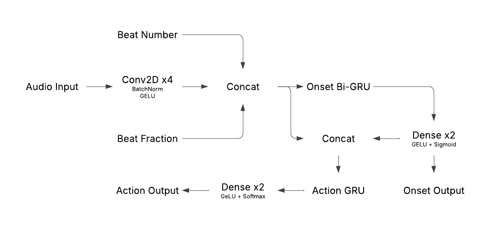

# mania-gen: beatmap generation for osu! mania

This project is for learning purposes!

The purpose of this program is to create a model to generate beatmaps in the rhythm game osu! mania from a given audio file (in addition to bpm and offset). The model 
uses a convolutional stack with mel spectrograms combined with extra contextual information to predict where musical onsets occur. This is then passed into
a recurrent neural network to convert onsets to predict combinations of key presses.

This model was trained on a dataset of about 200 songs, in addition to [another dataset](https://drive.google.com/drive/folders/1wNUPNz9u28aUMQuqA6e9-OwSxL_SJ6qw?usp=sharing) created by
Sihun Lee & Dasaem Jeong. This project took inspiration from many sources, a few being [osumapper by kotritrona](https://github.com/kotritrona/osumapper) and [AutoOsu by issyun](https://github.com/issyun/AutoOsu)
